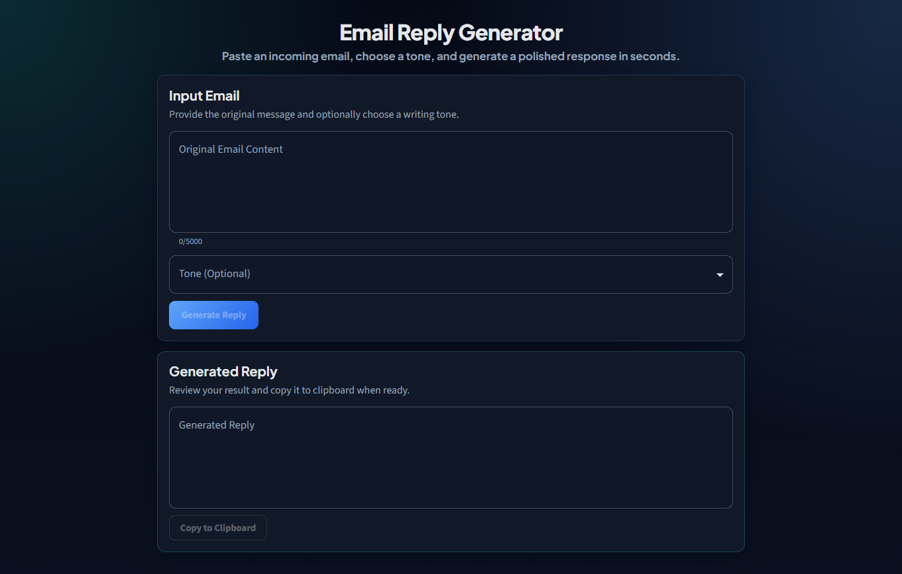
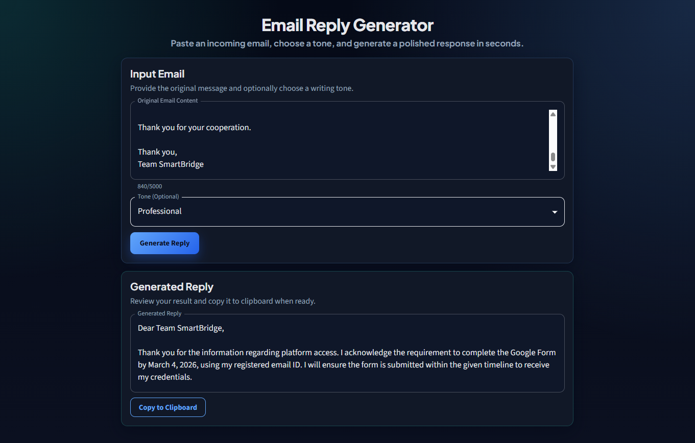
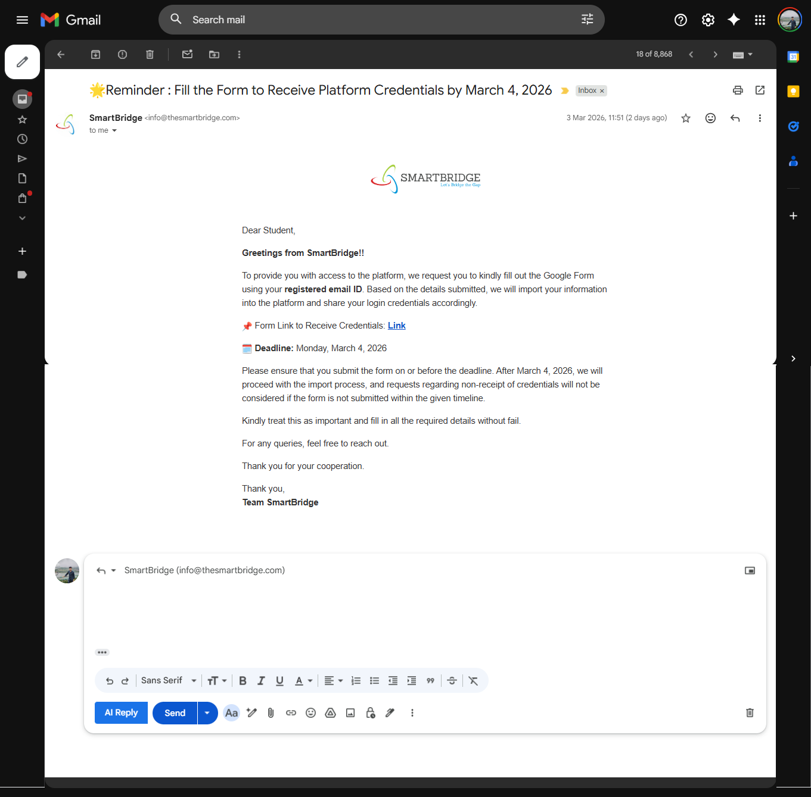
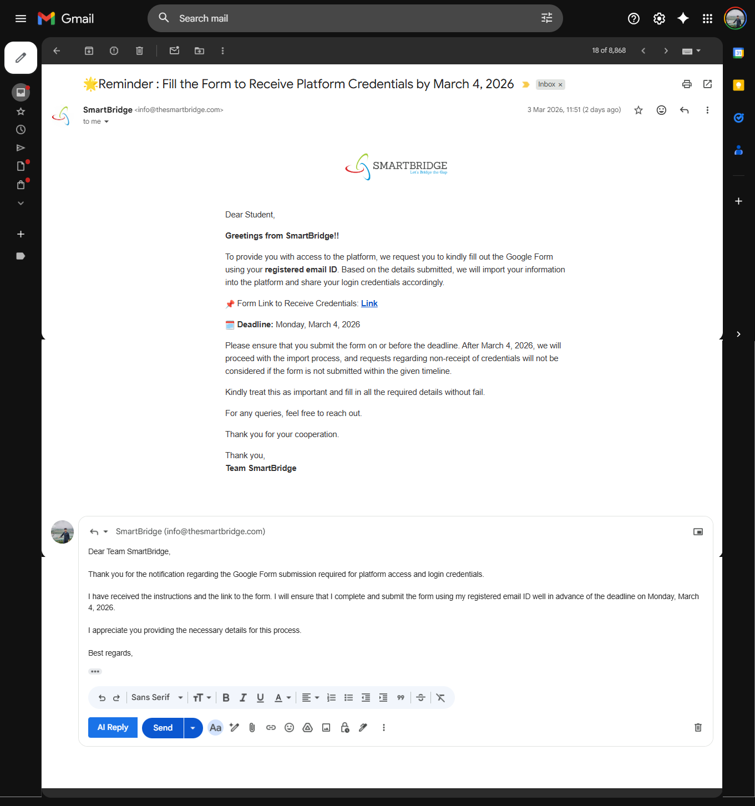

# Email Assistant 📧

An AI-powered email reply generator that helps you draft professional email responses with ease. This project integrates Google Gmail with Google's Gemini AI to intelligently generate contextualized, tone-aware email replies.

## 📸 Screenshots

### Web Application (Frontend)

| Before Generating Reply | After Generating Reply |
|:-----------------------:|:----------------------:|
|  |  |

### Chrome Extension

| Extension View (Before) | Extension View (After) |
|:-----------------------:|:----------------------:|
|  |  |

---

## 🌟 Features

- **AI-Powered Email Generation** - Leverages Google Gemini AI to generate intelligent, context-aware email replies
- **Customizable Tone** - Choose from multiple tones (professional, casual, formal, friendly, etc.) to match your communication style
- **Gmail Integration** - Seamless Chrome extension that integrates directly into Gmail's interface
- **Rate Limiting** - IP-based rate limiting to prevent abuse and ensure fair usage
- **Content Validation** - Smart validation ensuring email content is between 10-5000 characters
- **Copy & Paste Ready** - Generated replies can be easily copied and pasted into Gmail
- **Error Handling** - Comprehensive error messages and user-friendly notifications
- **Cross-Origin Support** - Configured CORS for secure extension-to-backend communication

## 🏗️ Architecture

This project consists of three main components:

| Component | Type | Technology | Purpose |
|-----------|------|------------|---------|
| **email-assistant-backend** | REST API | Java 21 + Spring Boot 4.0.2 | Handles email generation requests, AI integration, and rate limiting |
| **email-assistant-frontend** | Web Application | React 19.2 + TypeScript + Vite | User interface for drafting emails with customizable tone |
| **email-assistant-ext** | Chrome Extension | JavaScript (Manifest v3) | Gmail integration layer that injects UI elements |

## 🛠️ Technology Stack

### Backend
- **Java 21** with **Spring Boot 4.0.2**
- **Spring WebFlux** - Reactive HTTP client for external API calls
- **Spring Validation** - Request validation
- **Bucket4j 8.7.0** - Token bucket rate limiting
- **Lombok 1.18.34** - Reduce boilerplate code
- **Google Gemini API** - AI model integration (gemini-2.5-flash)

### Frontend
- **React 19.2** with **TypeScript 5.9**
- **Vite 7.3** - Fast build tool and dev server
- **Material-UI (MUI) 7.3** - Modern UI component library
- **Axios 1.13.5** - HTTP client for API communication
- **Emotion** - CSS-in-JS styling solution

### Chrome Extension
- **Vanilla JavaScript**
- **Manifest V3** - Latest Chrome extension format
- **Content Scripts** - Gmail DOM manipulation
- **Popup Interface** - Quick access to the application

## 📁 Project Structure

```
email-assistant/
├── email-assistant-backend/          # Spring Boot REST API
│   ├── src/main/java/com/email_assistant/
│   │   ├── controller/               # REST endpoints
│   │   │   └── EmailController.java
│   │   ├── service/                  # Business logic
│   │   │   └── EmailService.java
│   │   ├── dto/                      # Request/Response models
│   │   │   ├── EmailRequest.java
│   │   │   └── EmailResponse.java
│   │   ├── config/                   # Configuration classes
│   │   │   ├── WebClientConfig.java
│   │   │   └── RateLimitConfig.java
│   │   ├── exception/                # Error handling
│   │   │   ├── GlobalExceptionHandler.java
│   │   │   ├── RateLimitExceededException.java
│   │   │   └── EmailGenerationException.java
│   │   └── EmailAssistantApplication.java
│   ├── src/main/resources/
│   │   └── application.properties    # Configuration
│   └── pom.xml                       # Maven dependencies
│
├── email-assistant-frontend/         # React + Vite Web Application
│   ├── src/
│   │   ├── components/               # React components
│   │   │   ├── EmailForm.tsx
│   │   │   └── ReplyPanel.tsx
│   │   ├── services/                 # API communication
│   │   │   └── emailService.ts
│   │   ├── types/                    # TypeScript interfaces
│   │   │   └── email.ts
│   │   ├── App.tsx                   # Main application component
│   │   ├── theme.ts                  # MUI theme configuration
│   │   └── main.tsx                  # Application entry point
│   ├── public/                       # Static assets
│   ├── index.html                    # HTML template
│   ├── vite.config.ts                # Vite configuration
│   ├── tsconfig.json                 # TypeScript configuration
│   └── package.json                  # NPM dependencies
│
└── email-assistant-ext/              # Chrome Extension
    ├── manifest.json                 # Extension configuration
    ├── popup.html                    # Extension popup UI
    ├── popup.js                      # Popup logic
    ├── content.js                    # Gmail page injection script
    └── content.css                   # Gmail custom styling
```

## 🔄 How It Works

```
1. User opens Gmail
   ↓
2. Chrome Extension injects "AI Reply" button into Gmail toolbar
   ↓
3. User clicks "AI Reply" button
   ↓
4. Extension popup opens → User clicks "Open Personalized App"
   ↓
5. React Frontend loads (http://localhost:5173)
   ↓
6. User enters/pastes email content and selects desired tone
   ↓
7. Frontend sends POST request to Backend API (/api/email/generate)
   ↓
8. Backend validates request and checks rate limit (IP-based)
   ↓
9. Backend constructs AI prompt with email content + tone
   ↓
10. Backend calls Google Gemini API (gemini-2.5-flash model)
    ↓
11. Backend extracts and returns AI-generated reply
    ↓
12. Frontend displays the generated reply
    ↓
13. User copies reply and pastes it into Gmail composer
```

## 🚀 Installation & Setup

### Prerequisites

- **Java 21** or higher
- **Node.js 18+** and npm
- **Maven 3.8+**
- **Google Gemini API Key** ([Get it here](https://ai.google.dev/))
- **Google Chrome** browser

### 1. Clone the Repository

```bash
git clone https://github.com/pawang001/email-assistant.git
cd email-assistant
```

### 2. Backend Setup

```bash
cd email-assistant-backend

# Configure application properties
# Edit src/main/resources/application.properties
# Add your Gemini API key:
# gemini.api.key=YOUR_GEMINI_API_KEY_HERE

# Build and run the backend
mvn clean install
mvn spring-boot:run

# Backend will start on http://localhost:8081
```

**application.properties configuration:**
```properties
server.port=8081
gemini.api.key=YOUR_GEMINI_API_KEY
gemini.api.url=https://generativelanguage.googleapis.com/v1beta/models/gemini-2.5-flash:generateContent
```

### 3. Frontend Setup

```bash
cd email-assistant-frontend

# Install dependencies
npm install

# Start development server
npm run dev

# Frontend will start on http://localhost:5173
```

### 4. Chrome Extension Setup

```bash
# 1. Open Chrome and navigate to chrome://extensions/
# 2. Enable "Developer mode" (toggle in top-right corner)
# 3. Click "Load unpacked"
# 4. Select the email-assistant-ext directory
# 5. The extension icon will appear in your Chrome toolbar
```

## 📖 Usage Guide

### Using the Extension in Gmail

1. **Open Gmail** in Google Chrome
2. **Look for the "AI Reply" button** injected into the Gmail toolbar (next to compose)
3. **Click "AI Reply"** to open the extension popup
4. **Click "Open Personalized App"** to launch the React frontend

### Generating Email Replies

1. **Paste or type** the email content you want to reply to (10-5000 characters)
2. **Select a tone** from the dropdown (optional):
   - Professional
   - Casual
   - Formal
   - Friendly
   - Enthusiastic
3. **Click "Generate Reply"**
4. **Wait for AI** to generate the response (usually 2-5 seconds)
5. **Copy the generated reply** using the copy button
6. **Paste into Gmail** composer and send

### Standalone Web Application

You can also use the frontend directly without the extension:

1. Navigate to `http://localhost:5173` in any browser
2. Follow the same steps as above to generate replies

## 🔌 API Documentation

### Generate Email Reply

**Endpoint:** `POST /api/email/generate`

**Request Body:**
```json
{
  "emailContent": "Thank you for your inquiry about our product pricing...",
  "tone": "professional"
}
```

**Request Validation:**
- `emailContent`: Required, 10-5000 characters
- `tone`: Optional, string

**Response (Success - 200 OK):**
```json
{
  "generatedReply": "Dear valued customer,\n\nThank you for reaching out regarding our product pricing..."
}
```

**Response (Error - 429 Too Many Requests):**
```json
{
  "error": "Rate limit exceeded. Please try again later."
}
```

**Response (Error - 400 Bad Request):**
```json
{
  "error": "Email content must be between 10 and 5000 characters"
}
```

**Rate Limits:**
- **10 requests per minute** per IP address
- Uses token bucket algorithm via Bucket4j

## 🧪 Development

### Running Frontend in Development Mode

```bash
cd email-assistant-frontend
npm run dev
```

### Building Frontend for Production

```bash
cd email-assistant-frontend
npm run build
npm run preview  # Preview production build
```

### Running Backend Tests

```bash
cd email-assistant-backend
mvn test
```

### Linting Frontend Code

```bash
cd email-assistant-frontend
npm run lint
```

## 🐛 Troubleshooting

### Backend Issues

- **API Key Error**: Ensure your Gemini API key is correctly set in `application.properties`
- **Port Already in Use**: Change the port in `application.properties` if 8081 is occupied
- **CORS Errors**: Verify CORS configuration in backend allows `http://localhost:5173`

### Frontend Issues

- **Cannot Connect to Backend**: Ensure backend is running on `http://localhost:8081`
- **Build Errors**: Delete `node_modules` and `package-lock.json`, then run `npm install` again

### Extension Issues

- **Button Not Appearing**: Refresh Gmail page after installing extension
- **Popup Not Opening**: Check Chrome DevTools console for errors
- **Extension Not Loading**: Ensure manifest.json is valid and all files exist

## 🤝 Contributing

Contributions are welcome! Here's how you can help:

1. **Fork** the repository
2. **Create** a feature branch (`git checkout -b feature/AmazingFeature`)
3. **Commit** your changes (`git commit -m 'Add some AmazingFeature'`)
4. **Push** to the branch (`git push origin feature/AmazingFeature`)
5. **Open** a Pull Request

## 👨‍💻 Author

**Pawang001**

- GitHub: [@pawang001](https://github.com/pawang001)

## 📞 Support

If you encounter any issues or have questions:

1. Check the [Issues](https://github.com/pawang001/email-assistant/issues) page
2. Create a new issue with detailed information
3. Provide steps to reproduce any bugs
